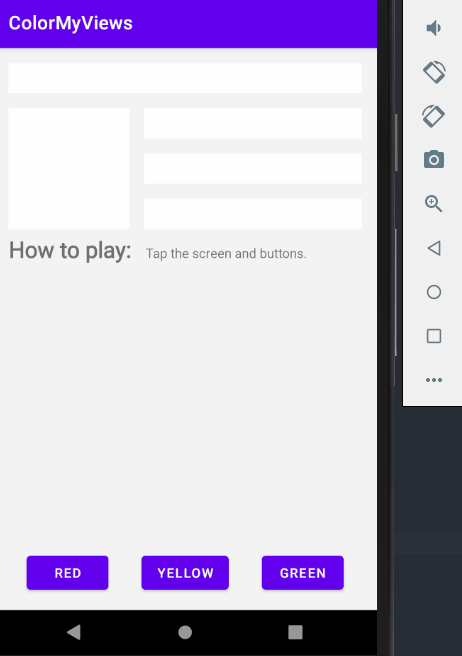

## ColorMyViews

-  강의 : https://developer.android.com/codelabs/kotlin-android-training-constraint-layout#0

# 목표

-  tap or button 으로 색이 변하는 박스 만들기

# 결과

[Virtual Device] - Nexus 5X (API LEVEL 30)

